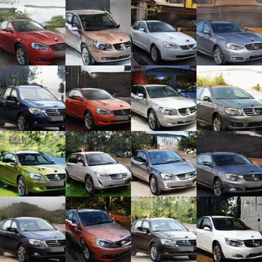
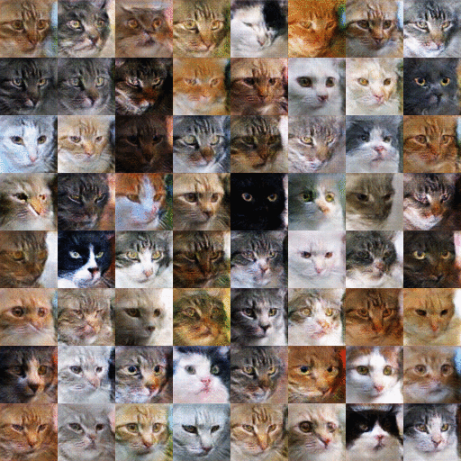

# HoloGAN
Code release for HoloGAN: Unsupervised learning of 3D representations from natural images. 

<p><table>
  <tr valign="top">
    <td width="50%"></td>
    <td width="50%"></td>
  </tr>
</table></p>

<p><table>
  <tr valign="top">
    <td width="50%"></td>
    <td width="50%"></td>
  </tr>
</table></p>

[HoloGAN: Unsupervised learning of 3D representations from natural images.]( https://www.monkeyoverflow.com/hologan-unsupervised-learning-of-3d-representations-from-natural-images/ ) [Thu Nguyen-Phuoc](https://monkeyoverflow.com/about/),  [Chuan Li](https://lambdalabs.com/blog/author/chuan/), Lucas Theis, [Christian Richardt]( https://richardt.name/ ) [Yong-liang Yang](http://yongliangyang.net/) 

International Conference on Computer Vision (ICCV) 2019 

## Dataset

CelebA:  http://mmlab.ie.cuhk.edu.hk/projects/CelebA.html 

LSUN: Dataset and pre-process code  https://github.com/fyu/lsun 

ShapeNet Chair: https://drive.google.com/file/d/18GXkDR5Fro8KCldYCcmJXoCEY9iunPME/view?usp=sharing

Cars: TBA

Cats: Dataset and pre-process code https://github.com/AlexiaJM/RelativisticGAN/tree/master/code 

## Training

- To run the training of HoloGAN

```	
python main.py ./config_HoloGAN.json --dataset celebA --input_fname_pattern ".jpg" --crop input_height 108--output_height 64
```
Help with config_HoloGAN.json

```
image_path:
			Full path to the dataset directory.
gpu:
			Index number of the GPU to use. Default: 0.
batch_size:
			Batch size. Defaults is 32.
max_epochs:
			Number of epochs to train. Defaults is 50.
epoch_step:
			Number of epochs to train before starting to decrease the learning 			   rate. Default is 25.
z_dim:
			Dimension of the noise vector. Defaults is 128.
d_eta:
			Learning rate of the discriminator.Default is 0.0001
g_eta:
			Learning rate of the generator.Default is 0.0001
beta1:
			Beta 1 for the Adam optimiser. Default is 0.5
beta2:
			Beta 2 for the Adam optimiser. Default is 0.999
discriminator:
			Name of the discriminator to use. 
generator:
			Name of the generator to use. 
view_func:
			Name of the view sampling function to use.
train_func:
			Name of the train function to use.
build_func:
			Name of the build function to use.
style_disc:
			Use Style discriminator. Useful for training images at 128.
sample_z:
			Distribution to sample the noise fector. Default is "uniform".
add_D_noise:
			Add noise to the input of the discriminator. Default is "false".
DStyle_lambda:
			Lambda for the style discriminator loss. Default is 1.0
lambda_latent:
			Lambda for the identity regulariser.Useful for training images at 			  128.Default is 0.0.
ele_low:
    		Default is 70.
ele_high:
			Default is 110.
azi_low:
			Default is 0.
azi_high:
			Default is 360.
scale_low:
			Default is 1.0
scale_high:
			Default is 1.0
x_low:
			Default is 0.
x_high:
			Default is 0.
y_low:
			Default is 0.
y_high:
			Default is 0.
z_low:
			Default is 0.
z_high:
			Default is 0.
with_translation:
			To use translation in 3D transformation. Default is "false".
with_scale:
			To use scaling in 3D transformation. Default is "false".
output_dir: 
			Full path to the output directory.
```

## Citation

If you use this code for your research, please cite our paper

```
@inproceedings{HoloGAN2019,
  title={ HoloGAN: Unsupervised Learning of 3D Representations From Natural Images  },
  author={Nguyen-Phuoc, Thu and Li, Chuan and Theis, Lucas and Richardt, Christian and Yang, Yong-Liang},
  booktitle = {The IEEE International Conference on Computer Vision (ICCV)},
 month = {Nov},
 year = {2019} 
}
```

